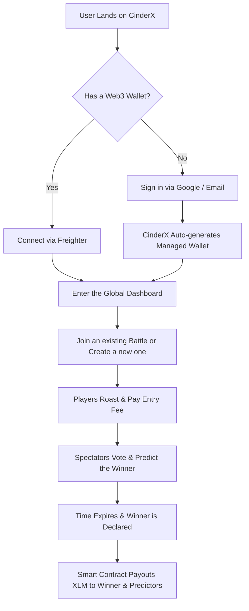
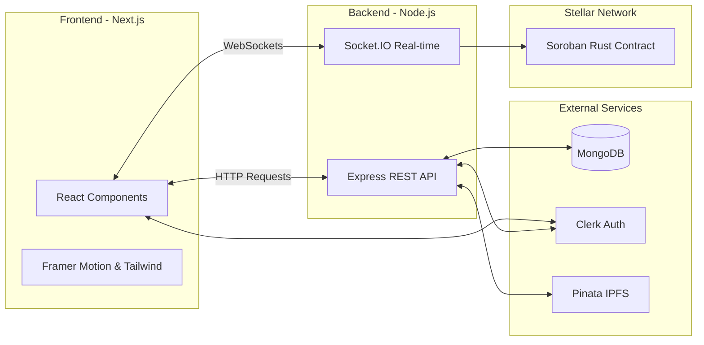

<div align="center">
  
  
  # 🔥 CinderX
  
  **Ignite. Battle. Conquer.** 
  
  *A next-generation gamified roast battle platform built on the Stellar blockchain.*
  
  [](https://opensource.org/licenses/MIT)
  [](http://makeapullrequest.com)
  [](https://stellar.org)

  [What is CinderX?](#-what-is-cinderx) • [How it Works](#-how-it-works-user-workflow) • [System Architecture](#-system-architecture) • [File Structure](#-file-architecture) • [Getting Started](#-getting-started)
</div>

---

## 📖 What is CinderX?

**CinderX** is a decentralized, real-time multiplayer arena where users engage in social roast battles. Think of it as a gamified social network combined with a competitive e-sports arena. 

Two players enter a live lobby and take turns roasting each other. Meanwhile, the community watches the battle unfold in real-time, placing predictions and casting votes on who delivered the best roast. Built on the **Stellar blockchain**, the winner of the battle—and the spectators who predicted correctly—take home real XLM crypto rewards automatically distributed by trustless smart contracts.

We built CinderX with an obsession for **beginner-friendly UX**. Web3 can be intimidating, so we seamlessly abstract away the crypto complexities. Users can sign in with just an email or Google account and get an auto-generated managed wallet under the hood, while crypto-natives can still connect their own Freighter wallets directly.

> **Built and maintained by [Suman Ghosh](https://github.com/SUMAN967-GHOSH) & the [Kernols](https://github.com/Kernols) Organization.**

---

## 🗺️ How it Works (User Workflow)

Here is a look at the journey a user takes when they land on CinderX:



---

## 🏗️ System Architecture

CinderX operates on a highly scalable, real-time architecture utilizing a modern Web2/Web3 hybrid stack.



### 💻 Tech Stack
*   **Client**: Next.js 14, React, Tailwind CSS, TypeScript, Framer Motion
*   **Server**: Node.js, Express, Socket.IO, Mongoose
*   **Blockchain**: Stellar SDK, Soroban (Rust)
*   **Infrastructure**: Vercel (Frontend), Render (Backend), Pinata IPFS (Storage)

---

## 📁 File Architecture

Our repository is structured as a monorepo containing everything needed to run the platform:

```text
cinderx/
├── Frontend/                 # Next.js 14 client application
│   ├── src/app/              # App router pages (dashboard, battle arena)
│   ├── src/components/       # Reusable UI components & animations
│   └── src/lib/              # Utilities, hooks, and state management
├── Backend/                  # Node.js + Express server
│   ├── src/modules/          # Domain-driven features (auth, battles, uploads)
│   ├── src/middlewares/      # Clerk & Socket auth protection
│   └── scripts/              # Stellar deployment & admin tools
├── contracts/cinderx/        # Soroban Rust smart contracts
│   ├── src/lib.rs            # Core contract logic for prize pooling
│   └── Cargo.toml            # Rust dependencies
├── .github/workflows/        # CI/CD pipelines for Vercel, Render, and Tests
├── DEPLOYMENT_GUIDE.md       # Comprehensive setup instructions
└── README.md                 # You are here!
```

---

## 🚀 Getting Started

We love open-source contributors! Follow these steps to spin up the project locally.

### Prerequisites
*   Node.js ≥ 18.x
*   MongoDB Atlas Account (or local instance)
*   Clerk Account (for Auth)
*   Stellar Testnet Account

### 1. Clone the repository
```bash
git clone https://github.com/Kernols/cinderx.git
cd cinderx
```

### 2. Setup the Environment Variables
Before running the app, you need to configure your API keys. Please read our comprehensive **[Deployment Guide](DEPLOYMENT_GUIDE.md)** for step-by-step instructions on setting up your `.env` files.

### 3. Start the Backend
```bash
cd Backend
npm install
npm run dev
```

### 4. Start the Frontend
```bash
cd ../Frontend
npm install
npm run dev
```

Your app should now be running locally at `http://localhost:3000`! 🎉

---

## 🤝 Contributing

CinderX is an open-source project and we welcome contributions from the community! Whether it's a bug fix, a new feature, or a documentation update, we'd love your help.

Please read our [Contributing Guidelines](CONTRIBUTING.md) to get started. 

*   **Bug Reports**: Use the [Bug Report Template](.github/ISSUE_TEMPLATE/bug_report.md).
*   **Feature Requests**: Use the [Feature Request Template](.github/ISSUE_TEMPLATE/feature_request.md).

Please ensure you adhere to our [Code of Conduct](CODE_OF_CONDUCT.md) in all interactions.

---

## 📄 License

This project is licensed under the MIT License - see the [LICENSE](LICENSE) file for details. 
© 2026 Suman Ghosh / Kernols
